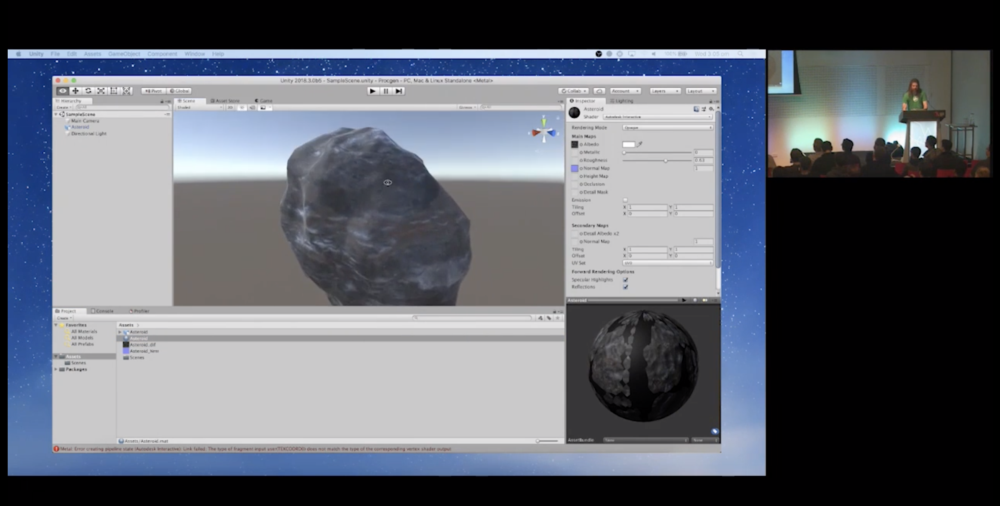

# Prockgen

This is the code and example .blend file from my talk at [GCAP 2018](https://gcap.com.au), "[Procedural Generation by Automating Blender](https://www.youtube.com/watch?v=GWD-s24YKCE)". It demonstrates how to procedurally generate and texture meshes through [Blender](https://blender3d.org)'s Python API.

**Important:** This talk was delivered in 2018, and was written for Blender 2.79. This is no longer the current version, and the scripts may not work. These scripts are useful for understanding the concepts of how to procedurally generate game assets in Blender,  but probably aren't a drop-in solution. (Pull requests that bring this up to date are welcome!)

## How to use it:

1. Download Blender.
2. Open 'GCAP 2018.blend'.
3. In the Text Editor pane, select the file 'asteroid_complete.py'.
4. Click Run script. It will generate, texture and export an asteroid into 'Procgen/Assets'.

The 'scripts' folder contains all of the code I demonstrated on stage. 'scripts/asteroid_complete.py' is probably the most interesting, and is fully commented.

'util.py' contains some helper functions that weren't particularly relevant to the talk's topic.

Follow me on Twitter, at [@desplesda](https://twitter.com/desplesda), and follow my studio, Secret Lab, at [@thesecretlab](https://twitter.com/thesecretlab)! You may also be interested in [Yarn Spinner](https://yarnspinner.dev), the narrative design tool I work on.

-- Jon

